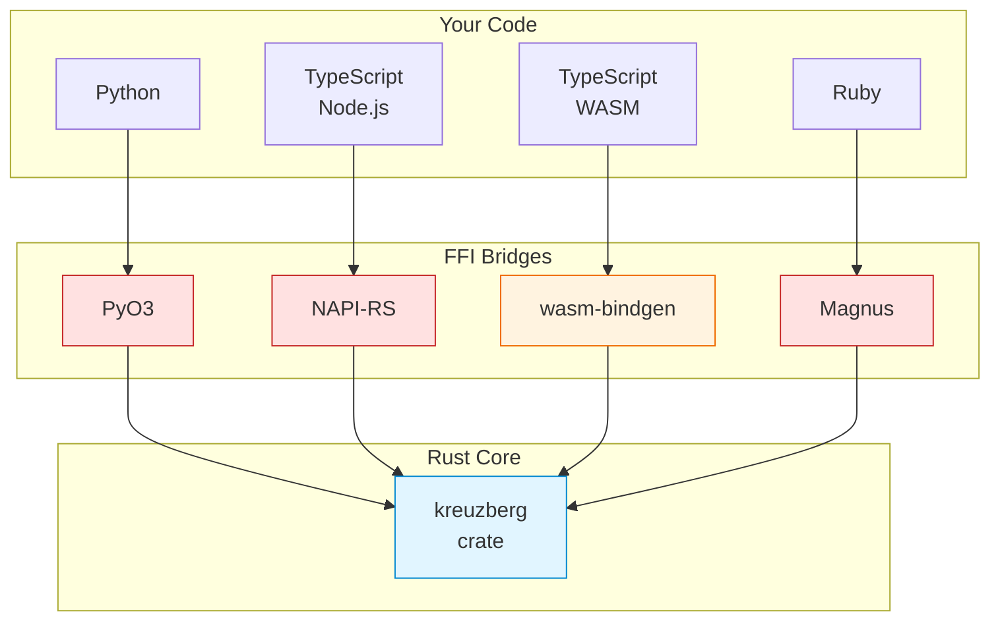
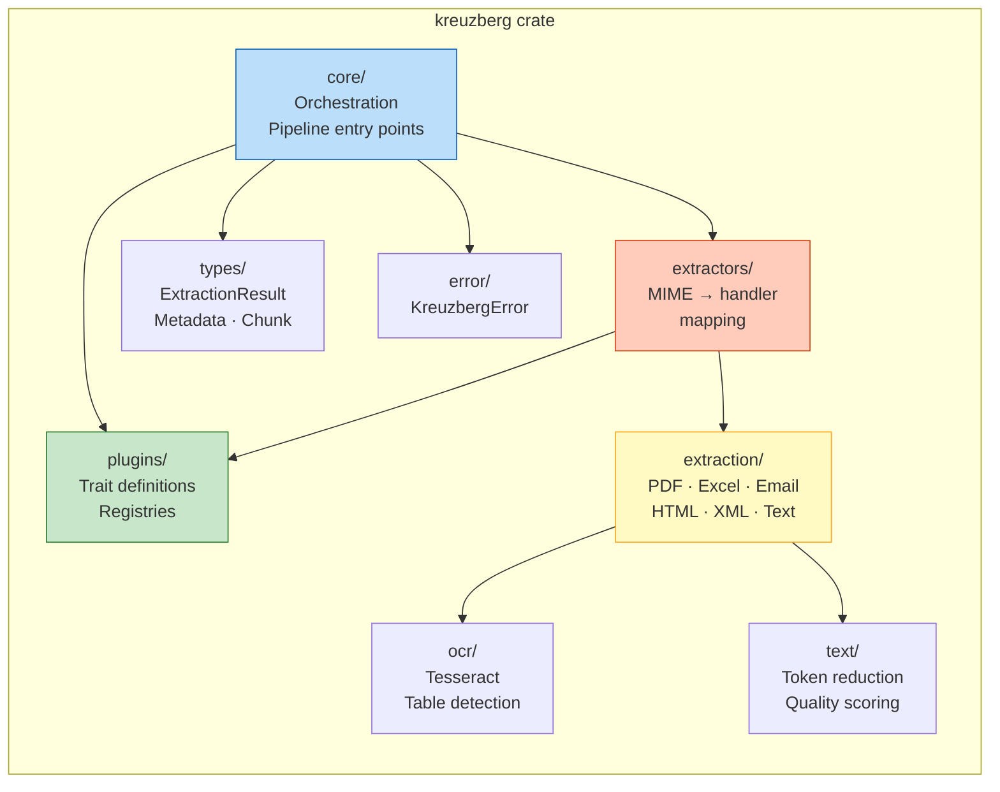
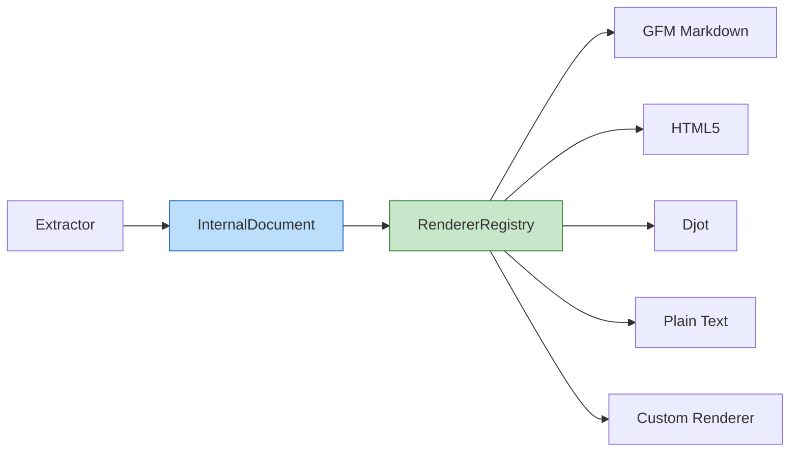

# Architecture

Kreuzberg is a document extraction library with a Rust core and native bindings for Python, TypeScript, Ruby, and more. The core handles all the expensive work (PDF parsing, OCR, text processing) and exposes it through thin language-specific wrappers. Your code calls directly into compiled Rust. No subprocesses, no serialization, no IPC overhead.

---

## Design Principles

Three ideas shape how Kreuzberg is built:

1. **Rust does the heavy lifting.** Every performance-critical operation runs as native Rust code - compiled, optimized, and fast.
2. **Plugins cross language boundaries.** A Python OCR backend can register itself with the Rust core and participate in the extraction pipeline as a first-class citizen.
3. **Minimize data copying.** Data passes across FFI boundaries using zero-copy techniques wherever possible. When a Python plugin receives file bytes, it gets a buffer protocol view into Rust-owned memory, not a copy.

---

## System Layers



Your code sits at the top. It calls into a bridge layer that translates types between your language and Rust. The bridge forwards the call to the Rust core, which does the actual extraction, OCR, and text processing. Results come back through the same bridge.

### TypeScript: Native vs Wasm

There are two TypeScript packages because server and browser environments have fundamentally different constraints:

- **`@kreuzberg/node`** (native) - compiled via NAPI-RS. Maximum performance on Node.js, Bun, and Deno. Requires a platform-specific native binary.
- **`@kreuzberg/wasm`** (WebAssembly) - compiled via wasm-bindgen. Runs in browsers, Cloudflare Workers, Vercel Edge, and any JavaScript runtime. About 60-80% of native speed, but zero native dependencies.

Rule of thumb: use native on servers, Wasm in browsers and edge runtimes. See the [Installation Guide](../getting-started/installation.md#typescript) for setup.

---

## Rust Core Structure

The core crate (`crates/kreuzberg`) is organized into modules with clear responsibilities:



| Module | Responsibility |
|--------|---------------|
| **core/** | Main entry points (`extract_file`, `extract_bytes`), MIME detection, config loading, pipeline orchestration |
| **plugins/** | Plugin trait definitions (`DocumentExtractor`, `OcrBackend`, `PostProcessor`, `Validator`, `Renderer`) and the registry system (ExtractorRegistry, OcrRegistry, ValidatorRegistry, ProcessorRegistry, RendererRegistry) |
| **extractors/** | Maps MIME types to the correct extractor implementation and registers them with the plugin system |
| **extraction/** | Format-specific extraction logic - PDF via pdfium, Excel via calamine, email parsing, and so on. |
| **ocr/** | OCR orchestration - Tesseract bindings, HOCR parsing, table detection |
| **text/** | Text processing utilities - token reduction, quality scoring, string manipulation |
| **types/** | Shared data structures: `ExtractionResult`, `Metadata`, `Chunk`, and friends |
| **error/** | Centralized error handling with the `KreuzbergError` enum |

---

## Rendering Pipeline

After extraction, the raw internal document representation is passed through the **RendererRegistry** to produce the final output in the requested content format. Kreuzberg uses a comrak-based AST bridge for GFM Markdown and HTML5 rendering, ensuring high-fidelity output with full table, heading, and list support.



The RendererRegistry selects the appropriate renderer based on the requested content format (`--content-format`). Built-in renderers cover Markdown (GFM via comrak), HTML5 (also via comrak), Djot, and plain text. Custom renderers can be registered through the plugin system to support additional output formats.

---

## Why Rust?

**Speed.** Rust compiles to native machine code with LLVM optimizations. PDF parsing uses native pdfium bindings with no interpreter overhead. Text processing uses SIMD instructions to handle multiple characters per CPU cycle. Batch extraction runs on all CPU cores through Tokio's async runtime.

**Safety.** Rust's type system and ownership model catch entire categories of bugs at compile time. No null pointer exceptions, no data races, no buffer overflows, no use-after-free. If it compiles, those runtime errors can't happen.

**Real concurrency.** Unlike Python (limited by the GIL), Rust executes on all available cores simultaneously. Tokio's work-stealing scheduler distributes async tasks efficiently. File I/O is non-blocking, so threads never stall waiting on disk.

For detailed performance analysis, see [Performance](../guides/development.md#performance).

---

## Using Kreuzberg from Rust

The Rust core is a standalone library. You don't need Python or Node.js to use it:

```rust title="main.rs"
use kreuzberg::{extract_file_sync, ExtractionConfig};

fn main() -> kreuzberg::Result<()> {
    let config = ExtractionConfig::default();
    let result = extract_file_sync("document.pdf", None, &config)?;
    println!("Extracted: {}", result.content);
    Ok(())
}
```

This makes Kreuzberg a fit for Rust-native applications, command-line tools, high-performance API servers, and embedded systems where Python or Node.js aren't practical.

---

## What to Read Next

- [Extraction Pipeline](extraction-pipeline.md) - how files flow through the system stage by stage
- [Plugin System](plugin-system.md) - extending Kreuzberg with custom extractors, OCR backends, and processors
- [Performance](../guides/development.md#performance) - why Rust matters for extraction performance
- [Creating Plugins](../guides/plugins.md) - step-by-step plugin development guide
