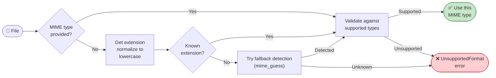

# MIME Type Detection

Before Kreuzberg can extract anything from a file, it needs to know what kind of file it is. That's what MIME detection does. It maps a file to a MIME type like `application/pdf` or `image/png`, which tells the pipeline which extractor to use.

If the MIME type can't be determined or isn't supported, extraction fails fast with an `UnsupportedFormat` error before any processing happens.

---

## How Detection Works

MIME detection is a two-step process: resolve the type, then validate it.



### Step 1: Resolve the MIME Type

If you pass an explicit `mime_type` parameter, Kreuzberg uses that directly (after validation).

If you don't, Kreuzberg extracts the file extension and looks it up in an internal mapping table. The extension is normalized first:

- **Lowercased:** `.PDF` and `.pdf` are treated identically
- **Dots stripped:** `.txt` becomes `txt`
- **Last extension only:** `archive.tar.gz` uses `gz`, not `tar`

```rust title="detect.rs (simplified extension-map step)"
let extension = path.extension()
    .and_then(|e| e.to_str())
    .unwrap_or("")
    .to_lowercase();

let mime_type = EXT_TO_MIME.get(extension.as_str())
    .ok_or(UnsupportedFormat)?;
```

If the extension is not in the map, Kreuzberg attempts a secondary detection using `mime_guess`. If detection still fails, it returns `UnsupportedFormat`.

### Step 2: Validate

Whether the MIME type came from you or from auto-detection, it's checked against the list of supported types. If it's not supported, you get an `UnsupportedFormat` error immediately. No resources are wasted on files Kreuzberg can't process.

---

## Supported Formats

### Documents

| Extension | MIME Type |
|-----------|----------|
| `.pdf` | `application/pdf` |
| `.docx` | `application/vnd.openxmlformats-officedocument.wordprocessingml.document` |
| `.doc` | `application/msword` |
| `.odt` | `application/vnd.oasis.opendocument.text` |
| `.rtf` | `application/rtf` |

### Spreadsheets

| Extension | MIME Type |
|-----------|----------|
| `.xlsx` | `application/vnd.openxmlformats-officedocument.spreadsheetml.sheet` |
| `.xls` | `application/vnd.ms-excel` |
| `.xlsm` | `application/vnd.ms-excel.sheet.macroEnabled.12` |
| `.xlsb` | `application/vnd.ms-excel.sheet.binary.macroEnabled.12` |
| `.ods` | `application/vnd.oasis.opendocument.spreadsheet` |
| `.csv` | `text/csv` |
| `.tsv` | `text/tab-separated-values` |

### Presentations

| Extension | MIME Type |
|-----------|----------|
| `.pptx` | `application/vnd.openxmlformats-officedocument.presentationml.presentation` |
| `.ppt` | `application/vnd.ms-powerpoint` |
| `.odp` | `application/vnd.oasis.opendocument.presentation` |

### Images

| Extension | MIME Type |
|-----------|----------|
| `.jpg`, `.jpeg` | `image/jpeg` |
| `.png` | `image/png` |
| `.gif` | `image/gif` |
| `.bmp` | `image/bmp` |
| `.tiff`, `.tif` | `image/tiff` |
| `.webp` | `image/webp` |
| `.svg` | `image/svg+xml` |

### Text and Markup

| Extension | MIME Type |
|-----------|----------|
| `.txt` | `text/plain` |
| `.md`, `.markdown` | `text/markdown` |
| `.html`, `.htm` | `text/html` |
| `.xml` | `application/xml` |
| `.json` | `application/json` |
| `.yaml` | `application/x-yaml` |
| `.toml` | `application/toml` |

### Email

| Extension | MIME Type |
|-----------|----------|
| `.eml` | `message/rfc822` |
| `.msg` | `application/vnd.ms-outlook` |

### Archives

| Extension | MIME Type |
|-----------|----------|
| `.zip` | `application/zip` |
| `.tar` | `application/x-tar` |
| `.gz` | `application/gzip` |
| `.7z` | `application/x-7z-compressed` |

### Ebooks

| Extension | MIME Type |
|-----------|----------|
| `.epub` | `application/epub+zip` |
| `.mobi` | `application/x-mobipocket-ebook` |

---

## Overriding Auto-Detection

Sometimes the extension doesn't tell the whole story. A `.txt` file might actually contain Markdown. A file might have no extension at all. In those cases, pass the MIME type explicitly:

```python title="override.py"
result = extract_file("notes.txt", mime_type="text/markdown", config=config)
```

This skips extension-based detection entirely and goes straight to validation.

---

## MIME Type Constants

Kreuzberg exports constants for common MIME types so you don't have to remember the strings:

```python title="using_constants.py"
from kreuzberg import extract_file, PDF_MIME_TYPE

result = extract_file("document.pdf", mime_type=PDF_MIME_TYPE, config=config)
```

Available constants: `PDF_MIME_TYPE`, `HTML_MIME_TYPE`, `MARKDOWN_MIME_TYPE`, `PLAIN_TEXT_MIME_TYPE`, `EXCEL_MIME_TYPE`, `DOCX_MIME_TYPE`, `JSON_MIME_TYPE`, `XML_MIME_TYPE`, and others.

---

## Detection API

Three utility functions for working with MIME types programmatically:

=== "Python"
    ```python
    from kreuzberg import detect_mime_type, validate_mime_type

    # Detect from file extension
    mime = detect_mime_type("report.pdf")     # → "application/pdf"

    # Validate a MIME type is supported
    validate_mime_type("application/pdf")     # → OK
    validate_mime_type("video/mp4")           # → raises UnsupportedFormat
    ```

=== "Rust"
    ```rust
    // Detect MIME type from file path
    let mime = detect_mime_type("report.pdf", false)?;

    // Validate a MIME type string
    let validated = validate_mime_type("application/pdf")?;

    // Detect-or-validate: uses explicit type if provided, else detects from path
    let mime = detect_or_validate(Some(path), None)?;
    ```

---

## Edge Cases

**Multiple extensions.** Only the last extension is used. `file.tar.gz` resolves to `application/gzip` (from `.gz`), not `application/x-tar`.

**No extension.** Files without an extension (like `Makefile` or `Dockerfile`) often cannot be auto-detected. In that case, Kreuzberg returns an error and you should provide an explicit MIME type:

```python
result = extract_file("Makefile", mime_type="text/plain", config=config)
```

**Case insensitive.** `.PDF`, `.Pdf`, and `.pdf` all resolve to `application/pdf`.

---

## What to Read Next

- [Extraction Pipeline](extraction-pipeline.md) — how the resolved MIME type drives the rest of the pipeline
- [Architecture](architecture.md) — overall system design
- [Configuration Guide](../guides/configuration.md) — format handling and MIME type options
- [Creating Plugins](../guides/plugins.md) — adding extractors for new MIME types
