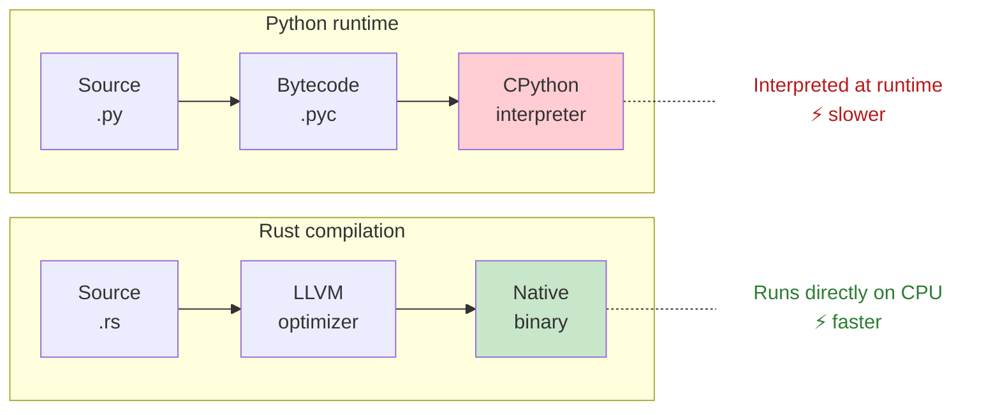
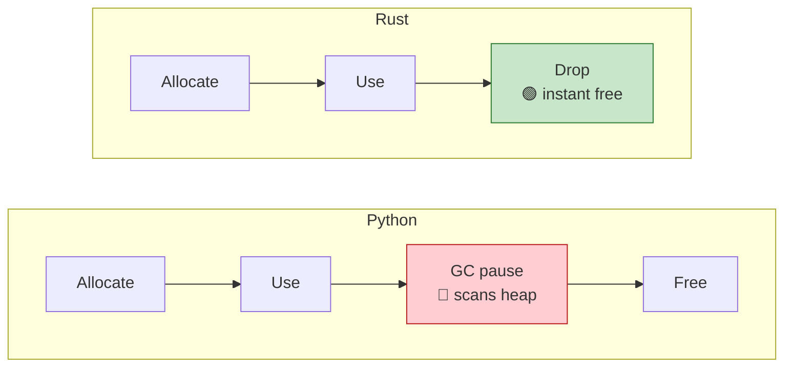
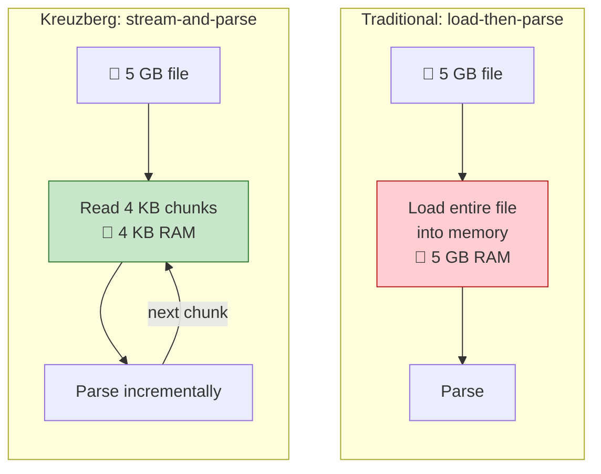

# Performance

Kreuzberg's core is written in Rust. That single decision is the source of most of the performance advantages described on this page: native compilation, real multi-core parallelism, zero-copy memory handling, and no garbage collector pauses. If you're coming from a Python-based extraction library, the difference is significant.

---

## Rust vs Python: Where the Speed Comes From

### Native Machine Code

Python runs through an interpreter (CPython) that evaluates code line by line at runtime. Rust compiles to native machine code ahead of time, with the full weight of LLVM optimizations applied before your program starts.



What the LLVM optimizer does before your code ever runs:

- **Inlining:** small function calls are replaced with their body, removing call overhead entirely
- **Dead code elimination:** unused branches are stripped out
- **Loop unrolling:** hot loops are flattened for CPU pipelines
- **SIMD vectorization:** character-by-character operations become parallel vector operations

### Zero-Copy Memory

In document extraction, you spend a lot of time slicing strings: pulling paragraphs out of pages, splitting tokens, building chunks. How a language handles string slicing matters.

Python creates a new string object for every slice. Rust borrows a reference into the original memory with no allocation and no copy.

```python title="python_slicing.py"
text = content[100:500]  # allocates a brand-new string object
```

```rust title="rust_slicing.rs"
let text: &str = &content[100..500];  // pointer + length, zero allocation
```

The practical impact: less memory pressure, fewer allocations for the allocator to track, and better CPU cache hit rates because the working set stays small.

### SIMD Acceleration

Some of Kreuzberg's text processing hot paths use SIMD (Single Instruction, Multiple Data) to process 16 or 32 characters in a single CPU instruction instead of one at a time:

| Operation | SIMD speedup |
|-----------|-------------|
| Whitespace detection (token reduction) | ~37x |
| Character classification (quality scoring) | ~27x |
| Character counting (string utilities) | ~15-20x |

### True Multi-Core Parallelism

Python's Global Interpreter Lock (GIL) allows only one thread to execute Python bytecode at a time, even on machines with many cores. Rust has no such restriction. Kreuzberg uses Tokio's async runtime with a work-stealing scheduler to spread extraction work across all available cores.

```python title="python_parallel.py"
with ThreadPoolExecutor() as executor:
    results = executor.map(extract_file, files)  # GIL: one thread at a time
```

```rust title="rust_parallel.rs"
let results = batch_extract_file(&files, None, &config).await?;  // all cores
```

Batch extraction scales near-linearly with core count.

### No Garbage Collector

Python's garbage collector periodically pauses execution to scan for unreachable objects. Rust uses deterministic drop semantics: memory is freed the instant a value goes out of scope. No scans, no pauses, predictable latency.



---

## Streaming Parsers

When you're extracting a 5 GB XML file or a large archive, loading everything into memory doesn't work. Kreuzberg's streaming parsers read and process data in small chunks, keeping memory usage constant regardless of file size.



Streaming extractors:

- **XML:** `quick-xml` event-based streaming
- **Plain text:** line-by-line reading
- **Archives:** on-the-fly decompression (no temp files)

---

## Native vs WASM: TypeScript Performance

Kreuzberg's TypeScript bindings come in two flavors. The performance difference comes down to native OS access vs sandboxed execution.

| Metric | Native (`@kreuzberg/node`) | WASM (`@kreuzberg/wasm`) | Gap |
|--------|---------------------------|--------------------------|-----|
| PDF extraction | ~100ms | ~125-165ms | 1.25-1.65x slower |
| OCR processing | ~500ms | ~625-825ms | 1.25-1.65x slower |
| Batch (100 files) | ~80ms/file | ~100-130ms/file | 1.25-1.65x slower |
| Memory overhead | 20-50MB | 50-150MB | 2-5x more |

**Why WASM is slower:** WASM runs inside a sandbox. JIT warm-up adds startup cost, a linear memory model replaces native pointers, every call across the WASM-JS boundary involves marshalling, parallelism requires Web Workers (with message-passing overhead), and the sandbox can't directly access file system or OS APIs.

**Which to choose:**

- **Server-side** (Node.js, Bun, Deno): use native. You want maximum throughput.
- **Browser / edge** (Cloudflare Workers, Vercel Edge): use WASM. It's the only option, and the 25-65% overhead is fine for interactive use.

---

## How Kreuzberg Stays Fast

Beyond the language-level advantages, Kreuzberg applies several optimization strategies at the application level.

### Caching

Extraction and OCR results are cached by a hash of file content + configuration. Typical hit rates are 85%+ for repeated files. The cache uses SQLite (~100MB for 10,000 files) and invalidates automatically when file content changes.

### Batch Processing

In Python, `batch_extract_files` distributes files across cores through the Rust runtime. For 10 files, batch processing is typically ~6x faster than sequential extraction.

```python title="batch_vs_sequential.py"
# Sequential: one at a time (~5s for 10 files)
for file in files:
    result = extract_file(file, config=config)

# Batch: all cores working (~0.8s for 10 files)
results = batch_extract_files(files, config=config)
```

### Lazy Initialization

Expensive resources like the Tokio runtime and plugin registries are initialized on first use, not at import time. If you only extract one file, you don't pay the cost of initializing subsystems you never touch.

### Fast Hash Maps

Internal data structures use `ahash` instead of Rust's default `SipHash`. AHash is 3-5x faster, uses SIMD acceleration on supported CPUs, and still provides DoS resistance via per-process randomization.

### Borrowed Strings

Where possible, Kreuzberg passes `&str` (borrowed string slices) instead of `String` (heap-allocated owned strings). This avoids allocations in read-only code paths like MIME type lookups and registry queries.

---

## Benchmarking

The best way to evaluate performance for your workload is to measure it with your actual files.

=== "Python"
    ```python
    import time
    from Kreuzberg import extract_file, batch_extract_files

    start = time.time()
    result = extract_file("large_document.pdf")
    print(f"Single file: {time.time() - start:.2f}s")

    files = [f"doc{i}.pdf" for i in range(100)]
    start = time.time()
    results = batch_extract_files(files)
    print(f"Batch (100 files): {time.time() - start:.2f}s")
    ```

=== "TypeScript"
    ```typescript title="benchmark.ts"
    import { extractFile, batchExtractFiles } from '@kreuzberg/node';

    const start = Date.now();
    const result = await extractFile('large_document.pdf');
    console.log(`Single file: ${(Date.now() - start) / 1000}s`);

    const files = Array.from({ length: 100 }, (_, i) => `doc${i}.pdf`);
    const batchStart = Date.now();
    const results = await batchExtractFiles(files);
    console.log(`Batch (100 files): ${(Date.now() - batchStart) / 1000}s`);
    ```

=== "Rust"
    ```rust title="benchmark.rs"
    use Kreuzberg::{extract_file_sync, batch_extract_file_sync, ExtractionConfig};
    use std::time::Instant;

    let config = ExtractionConfig::default();

    let start = Instant::now();
    let result = extract_file_sync("large_document.pdf", None, &config)?;
    println!("Single file: {:?}", start.elapsed());

    let files: Vec<_> = (0..100).map(|i| format!("doc{}.pdf", i)).collect();
    let batch_start = Instant::now();
    let results = batch_extract_file_sync(files, &config)?;
    println!("Batch (100 files): {:?}", batch_start.elapsed());
    ```

The full benchmark suite lives in `tools/benchmark-harness/`. Run it with `task bench` or `cargo bench`.

---

## What to Read Next

- [Architecture](architecture.md) — the system design that enables these performance characteristics
- [Extraction Pipeline](extraction-pipeline.md) — how the pipeline is optimized at each stage
- [Configuration Guide](../guides/configuration.md) — performance tuning options
- [Advanced Features](../guides/advanced.md) — profiling and benchmarking tools
