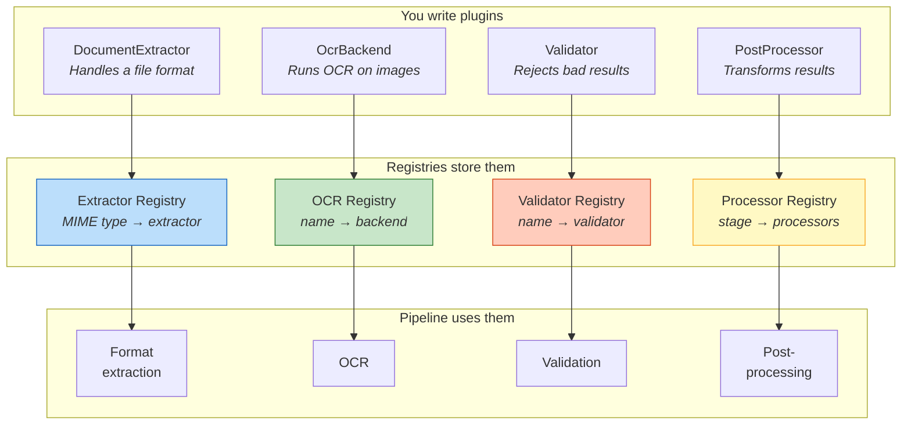
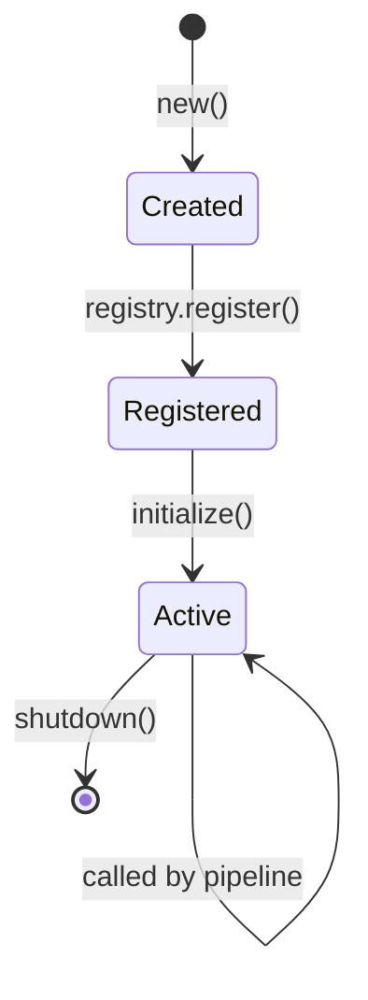
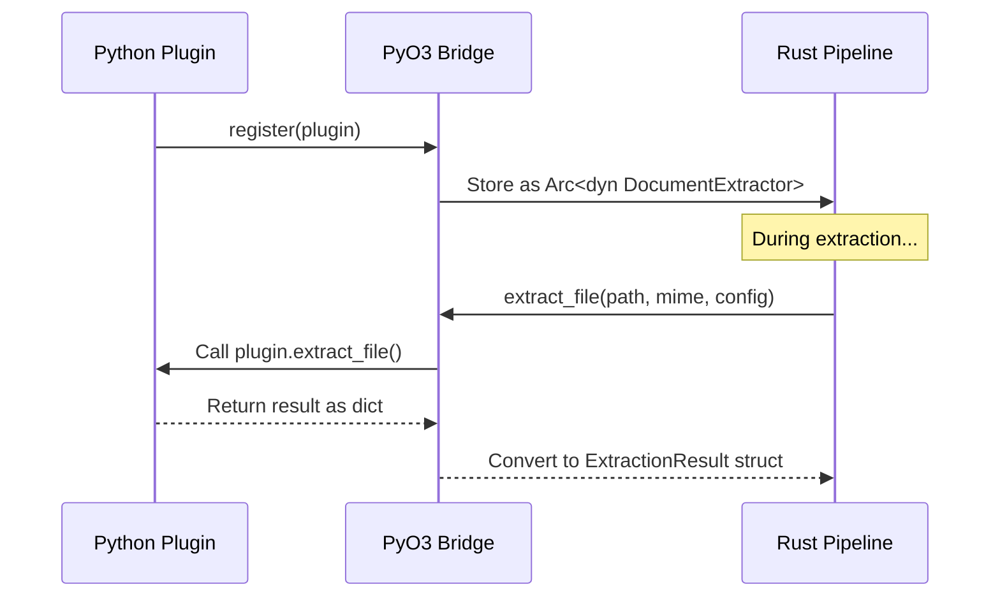

# Plugin System <span class="version-badge">v4.0.0</span>

Kreuzberg's extraction pipeline is entirely plugin-driven. Every format extractor, OCR engine, post-processor, and validator is a plugin that registers itself into a typed registry. The pipeline queries these registries at each stage to find the right handler. You extend Kreuzberg by writing your own plugin and registering it. The pipeline picks it up automatically.

This page explains the four plugin types, the registry mechanism, the plugin lifecycle, and how plugins work across language boundaries.

---

## Overview

The plugin system has three layers: plugins, registries, and the pipeline. Plugins implement a trait. Registries store them by key (MIME type, name, or processing stage). The pipeline queries the registries during extraction.



You register a plugin once. From that point on, the pipeline uses it wherever the MIME type, name, or stage matches. No wiring, no config files, no boilerplate.

---

## The Four Plugin Types

### DocumentExtractor

A `DocumentExtractor` teaches Kreuzberg how to extract text from a specific file format. It declares which MIME types it supports and provides two extraction methods: one for file paths, one for raw bytes.

```rust title="extractor_trait.rs"
#[async_trait]
pub trait DocumentExtractor: Plugin {
    fn supported_mime_types(&self) -> Vec<&str>;
    fn priority(&self) -> i32 { 0 }

    async fn extract_file(
        &self, path: &Path, mime_type: &str, config: &ExtractionConfig,
    ) -> Result<ExtractionResult>;

    async fn extract_bytes(
        &self, data: &[u8], mime_type: &str, config: &ExtractionConfig,
    ) -> Result<ExtractionResult>;
}
```

Kreuzberg ships with built-in extractors for PDF (via pdfium), Excel (via calamine), images (routes to OCR), XML, plain text, email, and Office formats (DOCX, PPTX).

**Priority resolution.** When two extractors are registered for the same MIME type, the one with the higher `priority()` value wins. Every built-in extractor has a priority of 0. To override the built-in PDF extractor with your own, register yours with a higher priority:

```rust title="override_builtin.rs"
impl DocumentExtractor for BetterPDFExtractor {
    fn priority(&self) -> i32 { 100 }
    // ...
}
```

Now when the pipeline encounters `application/pdf`, it selects `BetterPDFExtractor` instead of the default.

---

### OcrBackend

An `OcrBackend` performs optical character recognition on image data. It declares which languages it supports and provides a `process_image` method that takes raw image bytes and returns recognized text.

```rust title="ocr_trait.rs"
#[async_trait]
pub trait OcrBackend: Plugin {
    fn supports_language(&self, language: &str) -> bool;

    async fn process_image(
        &self, image_data: &[u8], language: Option<&str>, config: &OcrConfig,
    ) -> Result<OcrResult>;
}
```

Three backends ship out of the box:

| Backend | Engine | Strengths |
|---------|--------|-----------|
| **Tesseract** | Native Rust bindings | Fast, general-purpose, default backend. Good accuracy for Latin scripts. |
| **PaddleOCR** | ONNX Runtime | Best accuracy for CJK (Chinese, Japanese, Korean) scripts. No Python dependency. |
| **EasyOCR** | Python + PyTorch | Supports 80+ languages including Arabic, Hindi, and Thai. Only available through Python bindings. |

You can register your own OCR backend (e.g., a cloud-based API, a custom model) using the same trait.

---

### PostProcessor

A `PostProcessor` transforms the extraction result after the main extraction and OCR stages are complete. Each processor declares a `stage` that determines its execution order relative to other processors.

```rust title="postprocessor_trait.rs"
#[async_trait]
pub trait PostProcessor: Plugin {
    fn stage(&self) -> ProcessingStage;

    fn should_process(&self, result: &ExtractionResult, config: &ExtractionConfig) -> bool {
        true
    }

    async fn process(
        &self, result: ExtractionResult, config: &ExtractionConfig,
    ) -> Result<ExtractionResult>;
}
```

The three stages execute in fixed order:

| Stage | Runs | Purpose | Examples |
|-------|------|---------|---------|
| `Early` | First | Clean up raw text | Strip control characters, fix encoding, normalize whitespace |
| `Middle` | Second | Analyze content | Extract named entities, detect language, classify document type |
| `Late` | Third | Final output shaping | Format output, generate summaries, redact PII |

A design decision worth noting: **post-processor errors do not fail the extraction.** If a processor throws an exception, the error is logged and the pipeline continues with the result unchanged. This ensures a buggy or experimental processor can't take down your extraction pipeline.

---

### Validator

A `Validator` inspects the extraction result and can reject it if it doesn't meet your requirements. Unlike post-processors, **validator errors stop the pipeline immediately.** They're a hard gate.

```rust title="validator_trait.rs"
#[async_trait]
pub trait Validator: Plugin {
    fn should_validate(&self, result: &ExtractionResult, config: &ExtractionConfig) -> bool {
        true
    }

    async fn validate(&self, result: &ExtractionResult, config: &ExtractionConfig) -> Result<()>;
}
```

Two common validator patterns:

```python title="example_validators.py"
class MinimumLengthValidator:
    """Reject extractions that produce less than 100 characters."""
    def validate(self, result, config):
        if len(result.content) < 100:
            raise ValidationError("Text too short")

class QualityThresholdValidator:
    """Reject extractions with a quality score below 0.5."""
    def validate(self, result, config):
        if (result.quality_score or 0.0) < 0.5:
            raise ValidationError("Quality below threshold")
```

Validators run before post-processors. This means you can catch and reject bad results before any transformation work happens.

---

## Plugin Lifecycle

Every plugin, regardless of type, follows the same lifecycle from creation to shutdown.



The base `Plugin` trait that all four plugin types extend:

```rust title="base_trait.rs"
pub trait Plugin: Send + Sync {
    fn name(&self) -> &str;
    fn version(&self) -> String;
    fn initialize(&self) -> Result<()>;
    fn shutdown(&self) -> Result<()>;
}
```

`initialize()` is called lazily the first time the plugin is used, not when it's registered. This avoids startup overhead for plugins that may never be invoked. `shutdown()` runs when the plugin is removed from the registry or when the process exits. Both methods have default no-op implementations, so you only override them if your plugin needs setup or cleanup logic.

---

## Registering Plugins

The registration pattern is the same in every language. Get the registry, call register.

=== "Rust"
    ```rust
    let registry = get_document_extractor_registry();
    let mut registry = registry.write().unwrap();
    registry.register("my-pdf", Arc::new(MyPDFExtractor::new()))?;
    ```

=== "Python"
    ```python
    from kreuzberg import get_document_extractor_registry

    registry = get_document_extractor_registry()
    registry.register(MyPDFExtractor())
    ```

Once registered, the pipeline automatically uses your plugin for any matching MIME type (extractors), backend name (OCR), processing stage (post-processors), or validator name (validators).

---

## Cross-Language Plugins

Plugins written in Python can integrate directly with the Rust extraction pipeline. The PyO3 bridge layer handles all type conversion between Python and Rust automatically.

Here is what happens when a Python plugin is registered and then invoked during extraction:



The bridge handles type conversion between languages:

| Rust | Python | TypeScript |
|------|--------|------------|
| `Vec<u8>` | `bytes` | `Buffer` |
| `String` | `str` | `string` |
| Structs | Dataclasses | Plain objects |

For large data like file bytes and image buffers, the bindings are designed to minimize copying and use buffer protocols where supported. A Python plugin may receive file data as `bytes` or another buffer-compatible type, depending on the binding implementation and runtime behavior.

---

## Thread Safety

All plugins must implement `Send + Sync` because the extraction pipeline invokes them concurrently from Tokio's worker thread pool.

- **`Send`** means the plugin value can be moved to a different thread.
- **`Sync`** means multiple threads can hold references to the plugin simultaneously.

If your plugin needs mutable internal state (counters, connection pools, caches), wrap it in `Mutex`, `RwLock`, or use atomic types. The compiler will enforce this at build time.

---

## Plugin Discovery

Plugins can be registered in three ways:

1. **Built-in** — automatically registered when Kreuzberg initializes. These are the default extractors, OCR backends, and processors.
2. **Programmatic** — registered manually via the registry API, as shown above.
3. **Configuration-based** — loaded from `kreuzberg.toml` at startup (planned for a future release).

---

## What to Read Next

- [Creating Plugins](../guides/plugins.md) — step-by-step guide to building a custom plugin
- [Extraction Pipeline](extraction-pipeline.md) — where each plugin type fits in the extraction flow
- [Architecture](architecture.md) — overall system design
- [API Reference](../reference/api-python.md) — plugin API documentation
